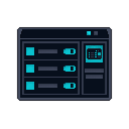
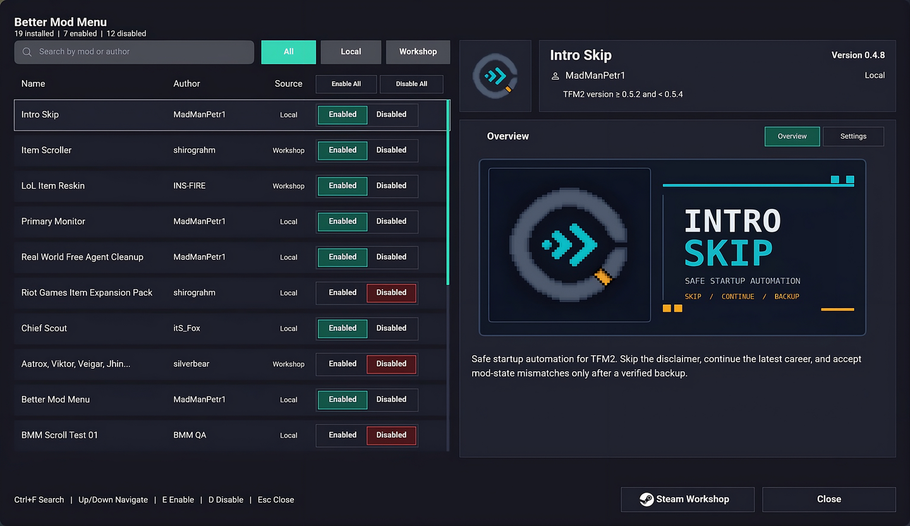
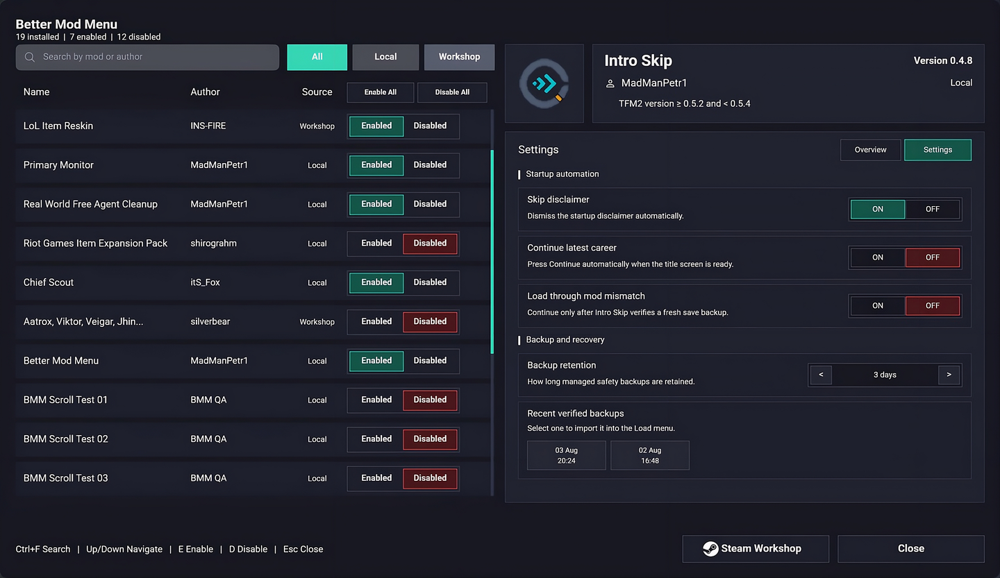
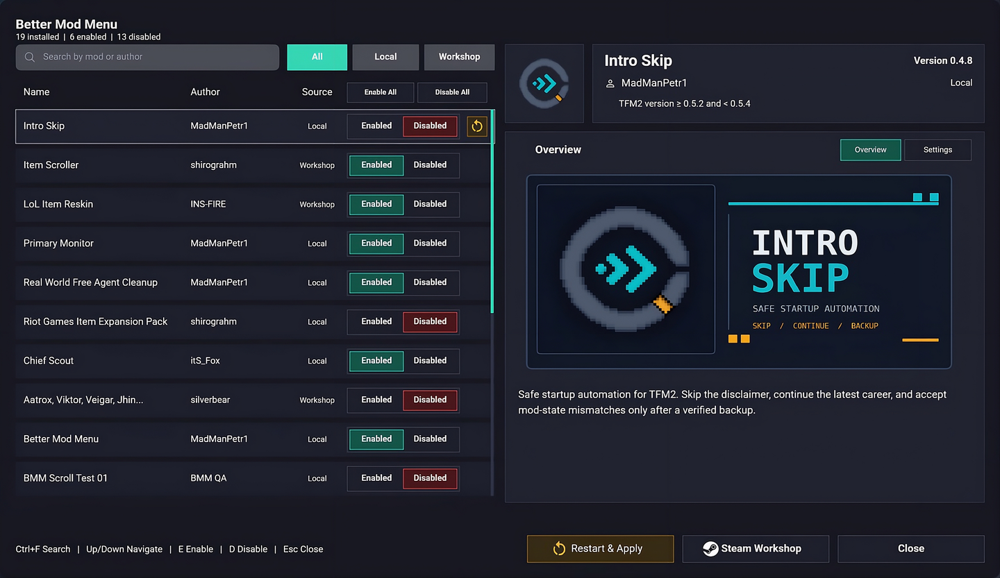
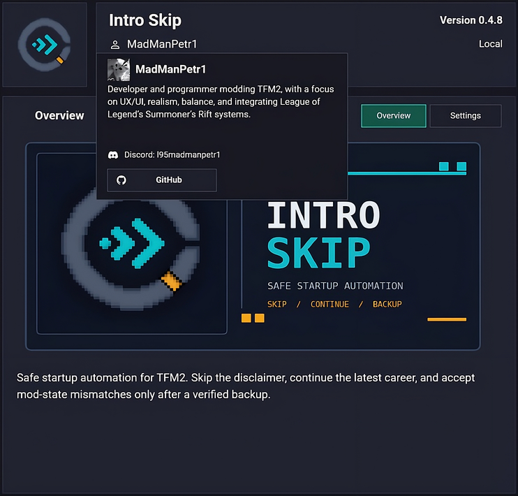

> [!IMPORTANT]
> ## Archived / Maintenance Paused
>
> This mod is currently unmaintained. The default branch preserves **Better
> Mod Menu 0.7.6**, the last known working release for **TFM2 0.5.8** and its
> legacy Mod SDK. It is not supported or verified on TFM2 0.6.0.
>
> Experimental and incomplete TFM2 0.6.0 Stable API work is preserved on
> [`recovery/tfm2-0.6.0-compat`](https://github.com/MadManPetr1/tfm2-better-mod-menu/tree/recovery/tfm2-0.6.0-compat).
> There is no planned maintenance schedule, though development may resume in
> the future. Resume by reviewing that recovery branch against the then-current
> SDK and validating it in game before publishing anything.

<div align="center">



# Better Mod Menu

A clearer, faster mod manager for **Teamfight Manager 2**.

**Better Mod Menu 0.7.6 · TFM2 0.5.8 · Windows**

</div>



Better Mod Menu keeps the game's native mod system, but makes installed mods
easier to search, understand, configure, and troubleshoot.

## Highlights

- Search by mod or author and filter Local or Workshop mods.
- Enable or disable mods with mouse or keyboard controls.
- See dependency problems before restarting the game.
- View mod thumbnails, banners, summaries, settings, and author profiles.
- Apply supported settings immediately without discarding unknown JSON data.
- Restart cleanly when a mod change requires it.

<details>
<summary><strong>More screenshots</strong></summary>

### Settings



### Restart and apply



### Author profile



</details>

## Install

1. Download `tfm2-better-mod-menu-v0.7.6.zip` from
   [GitHub Releases](https://github.com/MadManPetr1/tfm2-better-mod-menu/releases).
   Do not use GitHub's automatic source-code archive.
2. Extract the included `tfm2_better_mod_menu` folder into:

   ```text
   ...\SteamLibrary\steamapps\common\Teamfight Manager2\mods\
   ```

3. Enable **Better Mod Menu** in the native Mods screen and restart the game.

The final folder must contain `tfm2_better_mod_menu\mod.mod_info` and
`tfm2_better_mod_menu\tfm2_better_mod_menu.dll`.

## For mod authors

Mods require no special integration and continue to work without Better Mod
Menu. Two optional files unlock the richer interface:

| File | Purpose |
| --- | --- |
| `better_mod_menu.json` | Display metadata, settings, actions, and file cards |
| `better_mod_menu_profile.json` | Author bio, local profile icon, and validated contact links |

Using these JSON formats does not require publishing or relicensing the mod's
own source code.

Start with the [modder guide](MODDER_GUIDE.md), then use the copy-ready
[settings example](better_mod_menu.json.example),
[profile example](better_mod_menu_profile.json.example), and public
[settings](better_mod_menu.schema.json) / [profile](better_mod_menu_profile.schema.json)
schemas cover the complete format.

## Safety and compatibility

- Built against the `0.5.8` Mod SDK and tested on Teamfight Manager 2 `0.5.8`.
- Does not replace the game mod API or edit career saves.
- Treats manifests and action files as untrusted input.
- Restricts declared paths to the owning mod or its game-data directory.
- Ignores invalid optional integration files without blocking normal mod loading.
- Leaves validation and gameplay behavior under the owning mod's control.

## Build and verify

Install the Teamfight Manager 2 `0.5.8` Mod SDK, then run:

```powershell
.\build_local.ps1 -SdkDir "C:\path\to\Teamfight Manager2\mod-sdk-0.5.8"
.\scripts\validate_repo.ps1
.\scripts\package_release.ps1 -SdkDir "C:\path\to\Teamfight Manager2\mod-sdk-0.5.8"
```

Contribution expectations are kept in [CONTRIBUTING.md](CONTRIBUTING.md).

## License

Source code and documentation are licensed under
[GPL-3.0-or-later](LICENSE), with a narrow
[TFM2 linking exception and attribution terms](LICENSE-EXCEPTION.md).
Redistributions must preserve the original author and repository credit;
forks must use their own name and branding. See
[THIRD_PARTY_NOTICES.md](THIRD_PARTY_NOTICES.md) for bundled icon attribution.

This independent community mod is not affiliated with or endorsed by Team
Samoyed.
