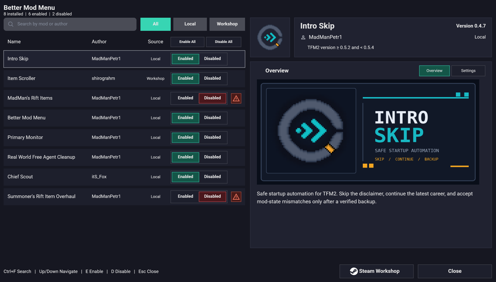
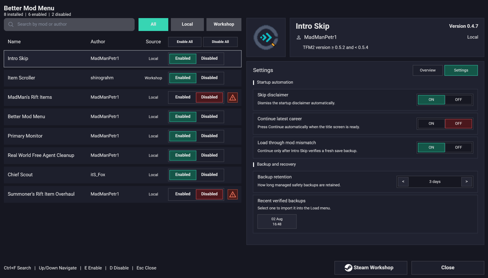
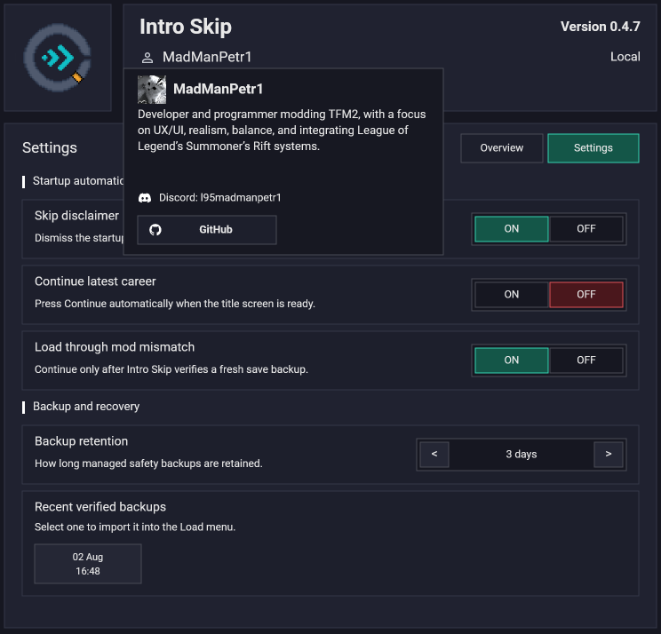

<div align="center">


# Better Mod Menu

A clearer, faster mod manager for **Teamfight Manager 2**.

**Better Mod Menu 0.6.0 · TFM2 0.5.3 · Windows**

</div>



Better Mod Menu keeps the game's native mod system, but makes installed mods
easier to search, understand, configure, and troubleshoot.

## Highlights

- Search by mod or author and filter Local or Workshop mods.
- Enable or disable mods with mouse or keyboard controls.
- See dependency problems before restarting the game.
- View mod thumbnails, banners, summaries, settings, and author profiles.
- Apply supported settings immediately without discarding unknown JSON data.
- Restart cleanly when a mod change requires it.

<details>
<summary><strong>More screenshots</strong></summary>

### Settings



### Author profile



</details>

## Install

1. Download `better-mod-menu-v0.6.0.zip` from
   [GitHub Releases](https://github.com/MadManPetr1/tfm2-better-mod-menu/releases).
   Do not use GitHub's automatic source-code archive.
2. Extract the included `mod_menu` folder into:

   ```text
   ...\SteamLibrary\steamapps\common\Teamfight Manager2\mods\
   ```

3. Enable **Better Mod Menu** in the native Mods screen and restart the game.

The final folder must contain `mod_menu\mod.mod_info` and
`mod_menu\mod_menu.dll`.

## For mod authors

Mods require no special integration and continue to work without Better Mod
Menu. Two optional files unlock the richer interface:

| File | Purpose |
| --- | --- |
| `better_mod_menu.json` | Display metadata, settings, actions, and file cards |
| `better_mod_menu_profile.json` | Author bio, local profile icon, and validated contact links |

Start with the [five-minute modder guide](MODDER_GUIDE.md). The
[manifest reference](MANIFEST.md), copy-ready
[settings example](better_mod_menu.json.example),
[profile example](better_mod_menu_profile.json.example), and public
[settings](better_mod_menu.schema.json) / [profile](better_mod_menu_profile.schema.json)
schemas cover the complete format.

## Safety and compatibility

- Built and runtime-tested for Teamfight Manager 2 `0.5.3`.
- Does not replace the game mod API or edit career saves.
- Treats manifests and action files as untrusted input.
- Restricts declared paths to the owning mod or its game-data directory.
- Ignores invalid optional integration files without blocking normal mod loading.
- Leaves validation and gameplay behavior under the owning mod's control.

## Build and verify

Install the Teamfight Manager 2 `0.5.3` Mod SDK, then run:

```powershell
.\build_local.ps1 -SdkDir "C:\path\to\Teamfight Manager2\mod-sdk-0.5.3"
.\scripts\validate_repo.ps1
.\scripts\package_release.ps1 -SdkDir "C:\path\to\Teamfight Manager2\mod-sdk-0.5.3"
```

Contribution expectations are kept in [CONTRIBUTING.md](CONTRIBUTING.md).
Security-sensitive reports should follow [SECURITY.md](SECURITY.md).

## License

Source code and documentation are licensed under
[GPL-3.0-or-later](LICENSE), with a narrow
[TFM2 linking exception and attribution terms](LICENSE-EXCEPTION.md).
Redistributions must preserve the original author and repository credit;
forks must use their own name and branding. See
[THIRD_PARTY_NOTICES.md](THIRD_PARTY_NOTICES.md) for bundled icon attribution.

This independent community mod is not affiliated with or endorsed by Team
Samoyed.
